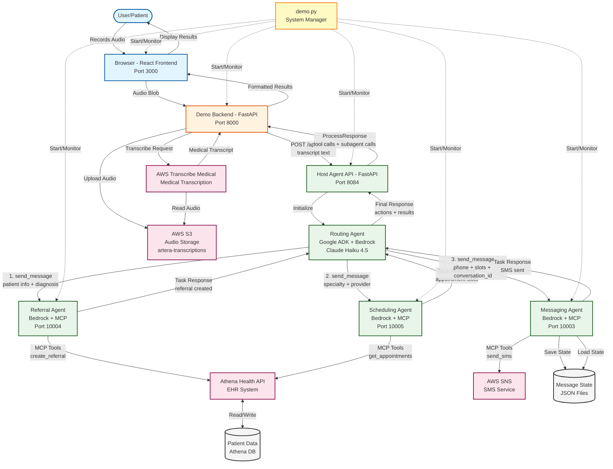

# A2A Healthcare Agent System Architecture

## Complete System Diagram

## System Components

### 1. User Interface Layer
- **React Frontend (Port 3000)**: Single-page application for recording medical conversations and displaying real-time agent execution
- **Audio Recording**: Uses browser MediaRecorder API to capture doctor-patient consultations
- **Results Display**: Shows chronological agent execution flow with expandable tool call details

### 2. Demo Backend Layer
- **FastAPI Backend (Port 8000)**: Orchestration bridge between frontend and agent infrastructure
- **Key Endpoints**:
  - `POST /api/upload-and-transcribe`: Uploads audio to S3 and triggers AWS Transcribe Medical
  - `POST /api/process`: Routes medical transcript to Host Agent for intelligent processing
- **Response Formatting**: Structures agent responses, tool calls, and subagent interactions for frontend display

### 3. Host Agent Layer - Intelligent Orchestration
**Host Agent API (Port 8084)**: FastAPI endpoint exposing the routing agent to external services

**Routing Agent** (Google ADK + AWS Bedrock Claude Haiku 4.5):
- **Context-Aware Intent Detection**: Analyzes medical transcripts to identify referral needs, scheduling requirements, and patient communication tasks
- **Sequential Workflow Execution**: Orchestrates specialized agents in proper clinical sequence (referral creation → appointment discovery → patient notification)
- **Parameter Inference**: Extracts and infers required parameters from conversational context:
  - Patient identification (ID, name, demographics)
  - Clinical context (diagnosis, symptoms, urgency)
  - Scheduling constraints (specialty, provider preferences, timing)
- **Adaptive Recovery**: Handles missing parameters by inferring reasonable defaults or requesting clarification
- **A2A Protocol Management**: Maintains conversation state across agent boundaries using Agent-to-Agent messaging protocol

**Key Capabilities**:
- Interprets implicit referral intent ("Let's have you see cardiology" → cardiology referral with appropriate urgency)
- Generates unique conversation IDs for patient messaging workflows (`appt_{patient_id}_{timestamp}`)
- Matches referral specialty to scheduling specialty automatically
- Provides transparent audit trail of all agent decisions and tool invocations

### 4. Specialized Agent Layer - Domain Experts
All agents use AWS Bedrock (Claude Haiku 4.5) with MCP (Model Context Protocol) for structured tool access to Athena Health APIs.

#### **Referral Agent (Port 10004)** - Medical Referral Creation
**Current Capabilities**:
- **Automated Referral Creation**: Creates complete referral orders in AthenaOne EMR
- **Diagnosis Code Mapping**: Maps natural language diagnoses to SNOMED CT and ICD-10 codes
- **Specialty Detection**: Identifies appropriate specialist type from clinical context
- **Encounter Management**: Initializes or retrieves active patient encounters

**MCP Tools**:
- `list_diagnoses`: Retrieves available SNOMED CT codes with ICD-10 mappings
- `list_referral_types`: Queries Athena for valid referral order types by specialty
- `create_referral_order`: Submits completed referral to EMR with diagnosis linkage
- `list_patients`: Searches patient database by name or demographics

**Future Enhancement** (demonstrated in `referral_form_with_chat.html`):
- **Interactive Form Pre-Population**: Auto-fills referral forms with extracted transcript data
- **Conversational Form Assistance**: Allows doctors to refine referrals through natural language dialogue
- **Confidence-Based Review**: Flags low-confidence fields for doctor confirmation before submission
- **Human-in-the-Loop Validation**: Retains doctor oversight while eliminating manual data entry

**Example Resilience**:
- Input: "Patient has chest pain, send to cardio"
  - Infers: specialty = "Cardiology", urgency = "urgent" (chest pain keyword), diagnosis = "chest pain" → SNOMED 29857009
- Input: "Refer John Doe for heart issues"
  - Searches patient by name, extracts "heart" → cardiology specialty, creates referral with appropriate diagnosis codes

#### **Scheduling Agent (Port 10005)** - Appointment Discovery
**Current Capabilities**:
- **Provider Search**: Finds specialists by department, specialty, and availability
- **Slot Discovery**: Queries available appointment times with configurable date ranges
- **Specialty Matching**: Ensures scheduled provider matches referral specialty requirements
- **Multi-Provider Fallback**: Offers alternative providers when primary choice unavailable

**MCP Tools**:
- `get_providers`: Retrieves providers filtered by department and specialty
- `find_appointment_slots`: Searches available times for specific provider and reason
- `get_open_appointment_slots`: Broader search across department for availability
- `list_departments`: Retrieves valid department IDs for appointment routing

**Guardrails Architecture**:
- Operates within predefined department (162) for controlled pilot deployment
- Limits appointment searches to configured date ranges (prevents infinite searches)
- Returns top 3 appointment slots to prevent model overload
- Validates appointment parameters before booking attempts

**Example Resilience**:
- Input: "Schedule cardiology follow-up"
  - Searches department 162 → filters cardiology providers → returns next 3 available slots
- Input: "Find appointment with Dr. Smith or any cardiologist"
  - Attempts Dr. Smith first → if unavailable, expands to all cardiology providers in department

#### **Messaging Agent (Port 10003)** - Patient Communication
**Current Capabilities**:
- **SMS Notification**: Sends appointment options to patients via AWS SNS
- **Conversational State Management**: Maintains multi-turn conversation context in JSON files
- **Appointment Confirmation**: Processes patient responses and updates appointment status
- **Cost Transparency**: Includes estimated appointment costs in notifications

**MCP Tools**:
- `send_sms`: Delivers SMS messages with appointment details and response options
- `receive_sms`: Processes incoming patient responses (YES/NO or natural language)
- `save_conversation_state`: Persists conversation history with appointment slot details
- `load_conversation_state`: Retrieves conversation context for multi-turn interactions

**State Persistence**:
- JSON files stored in `A2A-Framework/messaging_agent/message_state/`
- Filenames: `appt_{patient_id}_{specialty}_{timestamp}.json`
- Contains: conversation history, appointment slots offered, patient preferences, booking status

**Example Resilience**:
- Input: Patient receives 3 appointment options, replies "Friday works better"
  - Agent parses preference → searches Friday slots → offers refined options
- Input: Patient replies "YES" to second appointment option
  - Agent extracts slot from conversation state → books appointment → confirms via SMS

### 5. External Services Layer - Infrastructure
**AWS S3** (`artera-transcriptions` bucket):
- Stores audio recordings with unique identifiers
- Serves as input source for AWS Transcribe Medical
- Retention policy: 30 days (configurable)

**AWS Transcribe Medical**:
- Converts doctor-patient audio to medical-grade transcripts
- Speaker diarization (separates doctor vs. patient speech)
- Medical vocabulary optimization for clinical terminology
- HIPAA-compliant processing

**Athena Health API** (EHR Integration):
- REST API endpoints for referrals, appointments, patients, providers
- OAuth 2.0 authentication with scoped access
- Sandbox environment for development/testing
- Production-ready integration architecture

**AWS SNS** (SMS Delivery):
- HIPAA-eligible SMS delivery for appointment notifications
- Delivery status tracking and retry logic
- Phone number validation and formatting

### 6. Data Layer
**Athena Patient Database** (via API):
- Patient records (demographics, insurance, contact info)
- Encounter history and active encounters
- Provider and department directories
- Appointment schedules and availability
- Referral orders and tracking

**Message State Files** (Local JSON):
- Conversation history per patient
- Appointment slots offered and patient responses
- Booking status and confirmation tracking
- Metadata: patient ID, specialty, urgency, timestamps

### 7. System Management
**demo.py** - Unified System Launcher:
- Starts all 6 services in proper dependency order
- Health checks and port availability validation
- Centralized logging and process monitoring
- Graceful shutdown handling (CTRL+C)
- Service URLs and status display

**Services Managed**:
1. Referral Agent (10004) - 3s startup wait
2. Scheduling Agent (10005) - 3s startup wait
3. Messaging Agent (10003) - 3s startup wait
4. Host Agent API (8084) - 5s startup wait
5. Demo Backend (8000) - 3s startup wait
6. Demo Frontend (3000) - 3s startup wait
